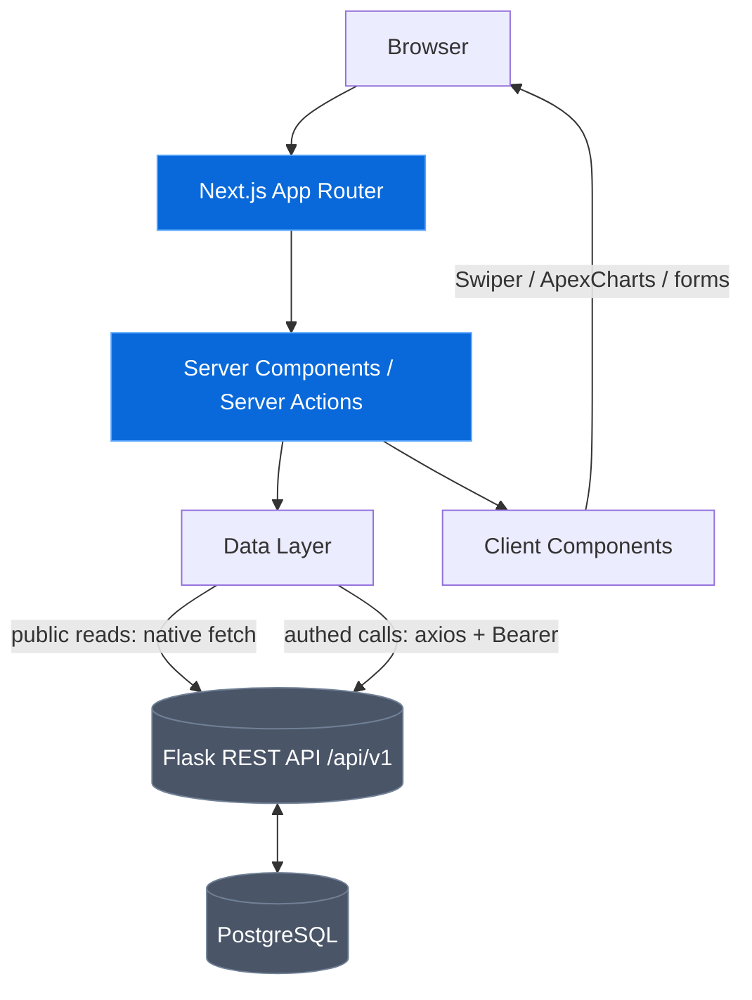

# RovoDevShop (Frontend)

> The web client for the **RovoShop** e-commerce marketplace — a Next.js (App Router) storefront that consumes the Flask + PostgreSQL REST API. Buyers browse listings and check out, sellers manage their own listings, and admins curate the catalog and moderate listings.

## Overview

RovoDevShop Web is the customer-facing surface of the RovoShop platform. It is a **pure frontend**: every piece of data comes from the Flask REST API (`/api/v1`) — there is no local database. The app is built with the Next.js App Router, mixing Server Components (for fast, SEO-friendly first paint) with targeted Client Components (for interactivity like the product carousel, charts, and search).

This README follows an SDLC narrative: requirements → design → implementation → testing → deployment.

---

## 1. Requirements

### User Roles

| Role       | Description                                                                                  |
| ---------- | -------------------------------------------------------------------------------------------- |
| Guest      | Browses listings/catalog and views detail. Cannot order.                                     |
| BUYER      | Default on registration. Browses, carts, orders, pays, manages own profile/addresses/orders. |
| SELLER     | A buyer who opted in. Creates/manages own listings (price/stock/status).                     |
| ADMIN      | Curates catalog + categories, moderates listings, manages users and orders.                  |
| SUPERADMIN | All ADMIN powers plus hard-delete and granting the SUPERADMIN role.                          |

> One account can hold multiple roles. Navigation items and actions are shown/hidden from JWT role claims.

### Functional Requirements (current checkpoint)

- **Storefront home** — hero, highlighted statistics (charts), a carousel of the **most popular** (most-ordered) products, and a first-5 product preview.
- **Product browse** — list all active listings with server-side search (`?search=`).
- **Product detail** — full listing + catalog spec, seller name, categories; dynamic page title.
- **Categories** — list all categories.
- **Orders** — list the signed-in user's orders.
- **Auth** — register, login (JWT), silent token refresh, logout.

### Non-Functional Requirements

- Server-rendered first paint for public pages; typed API contracts.
- Resilient data layer: every data-fetching route ships `loading` and `error` states.
- Environment-based API configuration (no hardcoded hosts).
- Responsive, mobile-first UI.

---

## 2. Design

### Architecture



### Hybrid Data Layer

Two complementary paths, chosen per call:

- **Public reads (native `fetch`)** — `app/lib/publicFetch.ts`. A thin wrapper with a `res.ok` check that throws a typed `ApiError` on failure. Used for the storefront, categories, and product detail. Reads `NEXT_PUBLIC_API_BASE_URL`.
- **Authenticated calls (axios)** — `app/lib/api.ts`. An axios instance with a request interceptor that attaches the `Bearer` access token from the httpOnly session cookie, and a response interceptor that refreshes the token once on a `401` and retries.

### Routing & Rendering

- App Router with route groups: `(shop)` (storefront shell with Header/Footer) and `(auth)` (login/register).
- A nested `products` layout keeps shared chrome mounted while navigating between the list and a detail page.
- Dynamic metadata via `generateMetadata` on the product detail route (real product name as the `<title>`).

### Session

Auth state lives in an encrypted, httpOnly cookie session (`app/lib/sessions.ts`), holding the Flask access + 7-day refresh tokens. `getSession()` transparently refreshes an expired access token using the refresh token before deciding a user is logged out.

---

## 3. Features

### Home / Storefront (`/`)

- Hero section with CTA and illustration.
- **Highlighted statistics** — ApexCharts sparklines (active users, units sold).
- **Most popular carousel** — Swiper carousel driven by the API via `GET /api/v1/seller-products?sort=-popular&per_page=5` (sorts by total units sold).
- **First-5 preview** — read-only product cards from the live catalog.
- About-me section (anchor `#about-me`) with a feedback form + live-feed marquee.

### Product Browse (`/products`)

- Server Component fetch of all active listings.
- Server-side search via the `?search=` query param, wired to a client `SearchBar` (`router.push`, `useSearchParams`).
- `loading.tsx` skeleton grid + `error.tsx` recovery UI.

### Product Detail (`/products/[id]`)

- Fetches a single listing by `params.id`; `notFound()` on a missing product.
- Shows catalog spec, **seller name**, and **category names** (not raw ids).
- `generateMetadata` sets a dynamic, per-product page title.

### Categories (`/categories`)

- Server Component fetch of `GET /api/v1/categories`.

### Orders (`/orders`)

- Server Component fetch of `GET /api/v1/orders` (authenticated).
- Friendly empty/sign-in state when there are no orders or no session.

### Cross-cutting

- Role-aware navigation with active-route highlighting (`usePathname`).
- Consistent Rupiah + title formatting helpers (`utils/format.ts`).
- Every data-fetching route has `loading.tsx` and `error.tsx`.

---

## 4. Tech Stack

| Layer               | Technology                                                                                                      |
| ------------------- | --------------------------------------------------------------------------------------------------------------- |
| Framework           | **Next.js (App Router)** — Server Components, Server Actions                                                    |
| UI library          | **React** + **TypeScript**                                                                                      |
| Styling             | **Tailwind CSS** (+ MUI components where useful)                                                                |
| Routing/navigation  | **`next/navigation`** (`usePathname`, `useSearchParams`, `router.push`)                                         |
| Carousel            | **Swiper**                                                                                                      |
| Charts              | **ApexCharts** / react-apexcharts                                                                               |
| Notifications       | **react-hot-toast**                                                                                             |
| Session persistence | encrypted httpOnly cookie session (jose) — with a `localStorage` fallback planned for client-side session hints |
| HTTP                | **axios** (authed) + native **fetch** (public reads)                                                            |
| E2E testing         | **Playwright** (set up in a later checkpoint)                                                                   |
| Config              | **`NEXT_PUBLIC_API_BASE_URL`** for environment-based API configuration                                          |
| Deployment          | **Vercel**                                                                                                      |

---

## 5. Project Structure

```text
module-3-frontend/
├── app/
│   ├── layout.tsx                      # Root layout + base metadata
│   ├── (shop)/
│   │   ├── layout.tsx                  # Storefront shell (Header + Footer)
│   │   ├── page.tsx                    # Home (hero, stats, popular carousel, first-5)
│   │   ├── products/
│   │   │   ├── layout.tsx              # Nested layout (stays mounted)
│   │   │   ├── page.tsx                # Browse + search
│   │   │   ├── loading.tsx             # Skeleton
│   │   │   ├── error.tsx               # Friendly error UI
│   │   │   └── [id]/page.tsx           # Detail + generateMetadata
│   │   ├── categories/                 # page.tsx + loading.tsx + error.tsx
│   │   └── orders/                     # page.tsx + loading.tsx + error.tsx
│   ├── (auth)/auth/{login,register}/page.tsx
│   ├── actions/                        # Server Actions (data + auth)
│   │   ├── catalog.actions.ts          # getCatalogues / getPopularCatalogues / getCatalogueById
│   │   ├── catalog.extra.actions.ts    # getCategories / getOrders
│   │   └── auth.actions.ts             # login / signup / logout
│   └── lib/
│       ├── api.ts                      # axios instance (authed, Bearer + refresh)
│       ├── publicFetch.ts              # native fetch + res.ok + typed ApiError
│       └── sessions.ts                 # cookie session (create/get/refresh/delete)
├── components/
│   ├── Header.tsx / HeaderClient.tsx   # nav + active route styling
│   ├── Footer.tsx
│   ├── SearchBar.tsx                   # ?search= navigation
│   ├── ProductCard.tsx / ProductGrid.tsx
│   └── home/                           # HomeSwiper, StatsCards, LiveFeedMarquee
├── utils/
│   ├── format.ts                       # formatRupiah / formatTitle
│   └── logger.ts
└── public/static/                      # illustrations
```

---

## 6. Setup & Run

### Prerequisites

- Node.js 20+
- The RovoShop Flask API running (default `http://127.0.0.1:8000`)

### Install & configure

```bash
npm install

# create .env (see .env.example)
# NEXT_PUBLIC_API_BASE_URL=http://127.0.0.1:8000   # public fetch layer
# API_SECRET_KEY=<32+ char secret for the session cookie>
```

### Run

```bash
npm run dev     # start the dev server (http://localhost:3000)
npm run build   # production build
npm run start   # serve the production build
npm run lint    # eslint
```

---

## 7. Testing

- **End-to-end:** Playwright (planned in a later checkpoint) will cover the critical flows — browse → search → detail, and auth → orders.
- **Type safety:** `npx tsc --noEmit` validates the full TypeScript surface, including API DTOs.
- Manual verification currently covers: home popular carousel, product search, dynamic detail titles, categories/orders fetch, active-route nav, and loading/error states.

---

## Rubric-only components (safe to remove)

> These exist **only** to satisfy a grading-rubric requirement for a client-side
> `ProductList` with `useEffect`/`useSearchParams` and a `CategoryFilter`. The
> real storefront uses the cleaner Server-Component approach
> (`app/(shop)/products/page.tsx` reads `searchParams` and fetches on the
> server). The rubric-only components are **not imported by any page** and do
> **not** affect the live UI.

**Files (delete to remove):**

- `components/ProductList.tsx` — `"use client"` list with a SearchBar
  (`router.push(/products?search=)` on Enter) and a `useEffect` that reads
  `useSearchParams()` and refetches on query/category change.
- `components/CategoryFilter.tsx` — dropdown that fetches `GET /categories` on
  mount and drives `GET /seller-products?category_id=`.

**To remove cleanly:** delete both files. Nothing else references them, so no
other change is needed. (If you ever wire `ProductList` into a page, also remove
that `<ProductList />` usage.)

---

## 8. Deployment

Deployed to **Railway**. Set the environment variables (`NEXT_PUBLIC_API_BASE_URL`, `API_SECRET_KEY`) in the Vercel project settings so the client points at the deployed Flask API.

Full interactive Website available online at **[https://module-3-miftahalrasyid-production.up.railway.app/](https://module-3-miftahalrasyid-production.up.railway.app/)**.

---

## Related

- Backend API: `module-2-miftahalrasyid` (Flask + PostgreSQL).
- Full product spec: `task_management_frontend_spec.md`.
