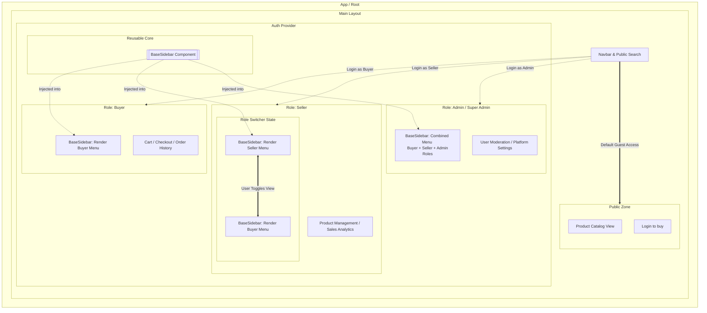
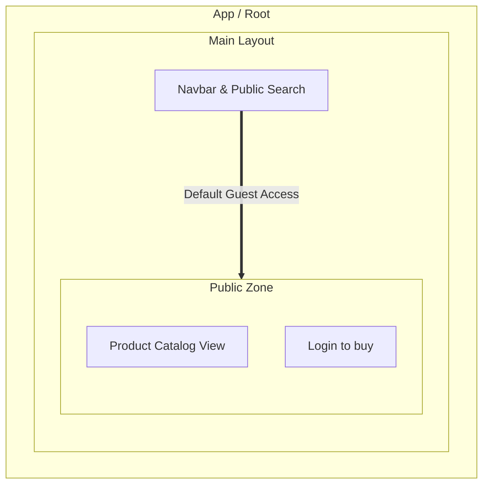
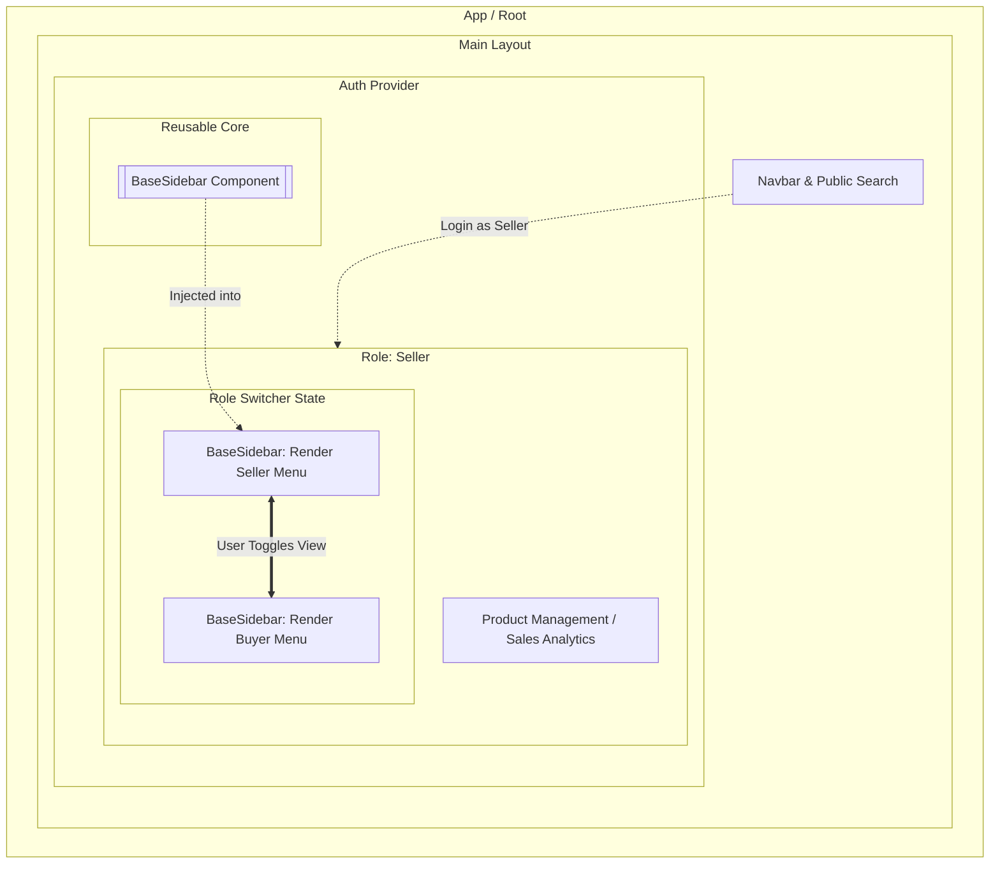
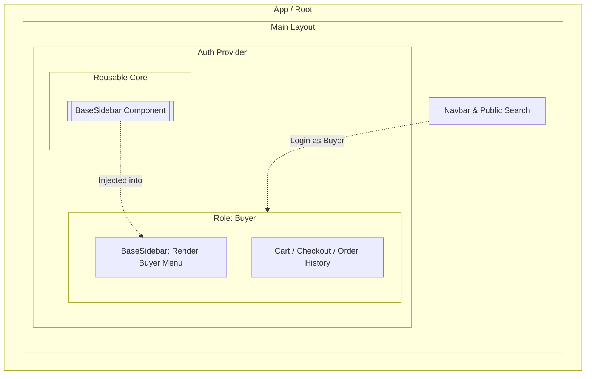
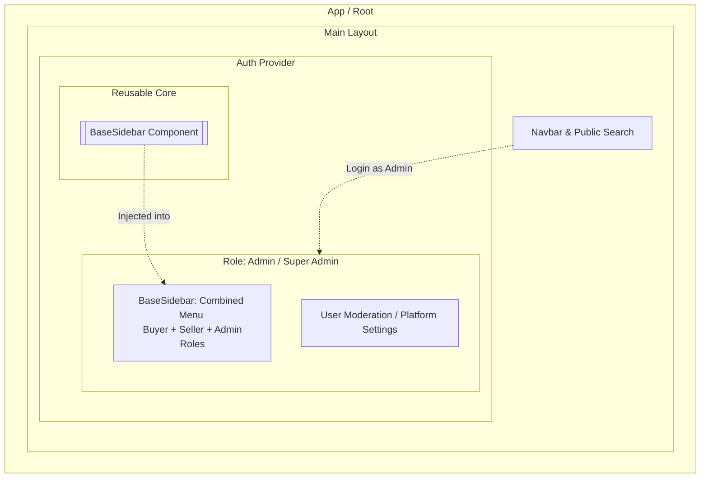

# ⚡ RovoDevShop - Web Project

Proyek pengembangan web responsif menggunakan **Vite**, **TypeScript**, dan **Tailwind CSS v4**.

## 🚀 Fitur Utama
*   **Vite Dev Server** — Proses *build* dan *Hot Module Replacement* (HMR) super cepat.
*   **TypeScript** — Kode JavaScript yang lebih aman dengan sistem tipe data (*static typing*).
*   **Tailwind CSS v4** — Manajemen desain modern menggunakan `@import "tailwindcss"` terintegrasi langsung via plugin Vite.
*   **Mobile Fullscreen Menu** — Navigasi mobile interaktif dengan animasi *slide-in* berbasis TypeScript asli.

---

## 🛠️ Persyaratan Sistem
Sebelum memulai, pastikan Anda sudah menginstal perangkat lunak berikut di komputer Anda:
*   [Node.js](https://nodejs.org) (Versi LTS sangat direkomendasikan)
*   [NPM](https://npmjs.com) (Otomatis terinstal bersama Node.js)

---

## Page component design

berikut ini adalah flow component design

### Home Page Sitemap

```mermaid
block-beta
    columns 12

    block:HomepageBlock:12
        columns 12
        homepageSpace["Header nav"]:1
    end
    style HomepageBlock fill:none,stroke:#38bdf8,stroke-width:2px,font-weight:bold,font-size:20px
    
    %% PERBAIKAN: Menghilangkan fill dan stroke total menggunakan kata kunci 'none'
    style homepageSpace fill:none,stroke:nonestroke:none,stroke-dasharray: 0 0
    

    block:StraplineBlock:12
        columns 12
        straplineSpace["Carousel Product"]:1
    end
    style StraplineBlock fill:#27272a,stroke:#f472b6,stroke-width:2px,color:#fff
    style straplineSpace fill:none,stroke:nonestroke:none,stroke-dasharray: 5 5

    block:HeroBlock["Category"]:12
        columns 12
        LSpacer[" "]:2
        SearchInput["..."]:8
        RSpacer[" "]:2
    end
    style HeroBlock fill:#1e293b,stroke:#60a5fa,stroke-width:2px,color:#60a5fa
    style LSpacer fill:#ffffff,stroke:#60a5fa,stroke-dasharray: 5 5
    style SearchInput fill:#ffffff,stroke:#60a5fa
    style RSpacer fill:#ffffff,stroke:#60a5fa,stroke-dasharray: 5 5

    block:AIBlock:12
        columns 1
        aiTitle["AI Powered Business intelligence"]
        aiText["⚡ ⚡ ⚡"]
    end
    style AIBlock fill:#27272a,stroke:#9ca3af,stroke-width:1px,color:#fff

    block:OmniBlock:12
        columns 12
        omniText["Omnichannel benefits <br> 📝 📝 📝"]:8
        omniImg["[ Image / Card ]"]:4
    end
    style OmniBlock fill:#27272a,stroke:#9ca3af,stroke-width:1px,color:#fff
    style omniImg fill:#1e293b,stroke:#9ca3af

    block:SolutionBlock:12
        columns 12
        solText["Our 6-in-1 solution <br> 📝 📝 📝"]:8
        solImg["[ Image / Card ]"]:4
    end
    style SolutionBlock fill:#27272a,stroke:#9ca3af,stroke-width:1px,color:#fff
    style solImg fill:#1e293b,stroke:#9ca3af
```


### Whole Access Role Flow


### Non User Role Flow

### Seller Role Flow


### Buyer Role Flow


### Admin Role Flow


## 💻 Panduan Instalasi & Menjalankan Proyek

Ikuti langkah-langkah di bawah ini untuk memasang dan menjalankan proyek di komputer lokal Anda:

### 1. Instalasi Dependensi
Buka terminal/command prompt di folder proyek ini, lalu jalankan perintah berikut untuk mengunduh semua *library* yang dibutuhkan (termasuk Tailwind CSS v4 dan TypeScript):
```bash
npm install
```

### 2. Menjalankan Server Pengembangan (Vite Dev)
Setelah proses instalasi selesai, jalankan perintah ini untuk menyalakan server lokal:
```bash
npm run dev
```

### 3. Membuka di Browser
Setelah server menyala, terminal akan menampilkan alamat URL lokal. Buka browser Anda dan akses alamat berikut:
```text
http://localhost:5173
```
*Catatan: Jika port `5173` sedang digunakan oleh aplikasi lain, Vite akan otomatis mengalokasikannya ke port lain seperti `5174`.*

---

## 📦 Perintah Terminal Lainnya yang Tersedia

| Perintah | Kegunaan |
| :--- | :--- |
| `npm run dev` | Menjalankan server lokal untuk proses *coding* (Development mode). |
| `npm run build` | Mengompilasi dan mengoptimasi kode menjadi file HTML, CSS, dan JS siap rilis ke server produksi (Production build). |
| `npm run preview` | Menjalankan server lokal khusus untuk menguji hasil dari perintah `npm run build` sebelum benar-benar di-online-kan. |

---

## 📁 Struktur Folder Utama
```text
── LICENSE
├── dist
│   ├── assets
│   │   ├── index-CGsulywL.css
│   │   └── index-Dezi127P.js
│   └── index.html
├── index.html
├── package-lock.json
├── package.json
├── readme.md
├── src
│   ├── app.ts
│   ├── component
│   │   ├── contactform.ts
│   │   └── swiper.ts
│   └── utils.ts
├── static
│   ├── image.png
│   └── web illustration.png
├── styles.css
├── tsconfig.json
├── tsconfig.node.json
├── vite.config.d.ts
├── vite.config.d.ts.map
├── vite.config.js
├── vite.config.js.map
└── vite.config.ts
```
